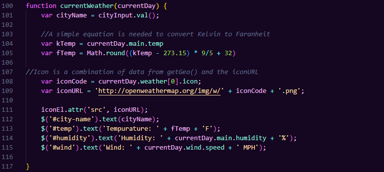

# weather-dashboard

## Description
Users can use the application to search for a city in the US and view weather data for the current time
as well as the next 5 days. Upon search, a button will be created in the aside so the user may easily go back and view
a previously searched city.

Try it out here! https://derekmedrano.github.io/weather-dashboard/
## Installation
N/A

## Usage
Here's a quick peek at the application

The following three functions are responsible for the main content of the page i.e. the current and future weather forecasts:

This getGeo function gets the necessary data needed to show an accurate forecast.

This function displays the most recently updated weather data from the given city.

This last function creates the 5 day weather forecast section and uses JQuery to create dymamic elements that are given classes from Bootstrap.

## Credits

Formatting/Stylization
Bootstrap -
https://getbootstrap.com/docs/5.3/getting-started/introduction/

Dates in five day forecast
day.js - 
https://day.js.org/

Font Choice
Google Fonts -
https://fonts.google.com/

JavaScript/Logic
JQuery API - 
https://api.jquery.com/

Weather Data & Icons
OpenWeatherMap API -
https://openweathermap.org/api

## License
N/A